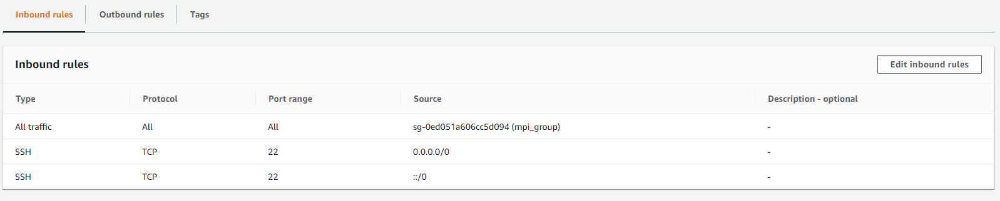

# Executando aplicações MPI na nuvem


### Configurar Rede

1. Entrar no AWS
2. Selecionar EC2
3. Selecionar Security Group
4. Clicar em "Create security group"
5. Preencher nome, descrição e selecionar a VPC
6. Configure o acesso SSH a partir de qualquer lugar
7. Adicionar uma regra inbound para permitir todo trafego a partir do security group
8. Clicar em "Create security group"



> Resultado obtido com a configuração do security group

### Criar instância base

1. Entrar no AWS
2. Selecionar EC2
3. Clicar em "Launch Instance"
4. Selecionar "Ubuntu Server 16.04 LTS (HVM), SSD Volume Type - ami-039a49e70ea773ffc (64-bit x86) / ami-0518d56c57a34cf51 (64-bit Arm)"
5. Clicar em "Select"
6. Selecionar "Instance Type": t3.small
7. Clicar em "Next: Configure Instance Details"
8. Selecione a subnet onde o seu security group está funcionando
9. Em "Configure Instance Details" preencher "User data" como "As text" e colocar o texto abaixo
```
#!/bin/bash
sudo apt-get update
sudo apt-get install -y wget make gcc libgfortran3 \
sysstat libibnetdisc-dev openmpi-bin libopenmpi-dev \
libhdf5-openmpi-dev gfortran build-essential git
```
10. Clique em "Add storage"
11. Selecione a capacidade de armazenamento do disco
12. Clique em "Add tags"
13. Clique em "Next: Configure Security Group"
14. Selecione o security group que foi criado
15. Clique em "Review and Launch"
16. Confira os dados utilizados e clique em "Launch"
17. Selecione a chave de acesso ou crie uma nova 
18. Clique em "Launch Instances"

### Configurar instância base

1. Conecte na instância criada `ssh -i "{chave.pem}" ubuntu@{IP}`
2. Atualize a versão do cmake
	1. `sudo apt remove cmake`
	2. `wget https://github.com/Kitware/CMake/releases/download/v3.17.2/cmake-3.17.2-Linux-x86_64.sh`
	3. `chmod +x cmake-3.17.2-Linux-x86_64.sh`
	4. `sudo bash cmake-3.17.2-Linux-x86_64.sh`
	5. `sudo ln -s /home/ubuntu/cmake-3.17.2-Linux-x86_64/bin/* /usr/local/bin`
3. Clone o gromacs `git clone https://github.com/MatheusFerraroni/gromacs-mo833a`
4. Entre na pasta `cd gromacs-mo833a`
5. Crie a pasta build `mkdir build`
6. Entre na pasta build `cd build`
7. Execute o cmake `cmake .. -DGMX_BUILD_OWN_FFTW=ON -DREGRESSIONTEST_DOWNLOAD=ON -DCMAKE_C_COMPILER=mpicc -DCMAKE_CXX_COMPILER=mpicxx -DGMX_MPI=on`
8. Execute o make `make -j`
9. Checagem `make check`
10. Voltar para a pasta principal `cd ..`
11. Criar a pasta experiments `mkdir experiments`
12. Entrar na pasta experiments `cd experiments`
13. Criar a pasta conf `mkdir conf`
14. Adicionar o arquivo `configurer.sh` na pasta experiments
15. Executar o configurer.sh `sh configurer.sh`
16. Gerar a chave de acesso `ssh-keygen`
17. Autorizar a chave gerada `cat ~/.ssh/id_rsa.pub >> ~/.ssh/authorized_keys`
16. Desconectar da máquina criada
17. Criar imagem da máquina
18. Terminar a máquina


### Configurar instâncias máquinas para a execução


1. Entrar no AWS
2. Selecionar EC2
3. Clicar em "Launch Instance"
4. Selecionar "My AMIs"
5. Selecione a imagem que foi criada anteriormente
6. Selecione o tamanho da instância
7. Configurar para iniciar 2 máquinas
8. Colocar no mesmo "Placement group"
9. Marcar a subnet válida para o security group
10. Adicionar storage
11. Adicionar tag
12. Selecionar o security group que foi criado nos passos anteriores
13. Criar e confirmar a key de acesso


### Executar gromacs

1. Anotar o `private ip` das duas máquinas criadas
2. Entrar em uma delas, que servirá ao mesmo tempo de master e slave
3. `cd gromacs-mo833a/experiment/conf/`
4. Executar a aplicação 
`mpirun -np 4 --host <private_ip_maquina_atual>,<private_ip_maquina_atual>,<private_ip_maquina_2>,<private_ip_maquina_2> ../../build/bin/gmx_mpi mdrun -v -deffnm em`
5. Aguardar completar
6. Sair da máquina
7. Stop nas duas instâncias