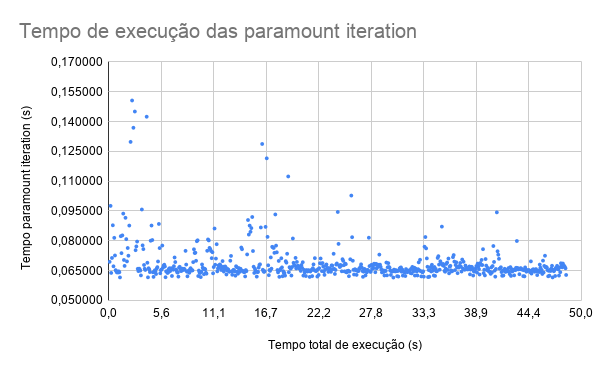

## Informações básicas

- versão Gromacs: 2020.2-dev-20200320-7267a4f-unknown
- cmake: 3.17.0
- GNU Make: 4.1
- gcc: 5.4.0 20160609

### SO Hospedeiro

- Sistema hospedeiro: Windows 10 PRO 64 bits versão 1903 (sem modificações)
- Memória RAM: 16gb 2400 Mhz
- Tipo de memória: SSD
- Proecssador: I5-9600k 6 núcleos

### SO Emulado

- Máquina virtual: Oracle VM VirtualBOX 6.1.14
- Sistema emulado: Ubuntu 16.04.6 LTS 64 bits (sem modificações)
- Memória RAM: 6gb 2400 Mhz
- Tipo de memória: SSD
- Proecssador: I5-9600k 1 núcleo

## Resultados

- **conf/results.txt**: arquivo contendo os tempos obtidos de inicialização, de cada paramount iteration e total de execução

Esses resultados também podem ser vistos na planilha: <a href="https://docs.google.com/spreadsheets/d/1qX-Y2Sg7wMEdy4PdPJIGQhvLxX6R_-bLHjALDVS2upE/edit#gid=0">https://docs.google.com/spreadsheets/d/1qX-Y2Sg7wMEdy4PdPJIGQhvLxX6R_-bLHjALDVS2upE/edit#gid=0</a>

A imagem abaixo mostra o tempo de execução de cada paramount iteration durante a execução de todo o programa.

	

Informações extras sobre as execuções são apresentadas na tabela abaixo

| Tempo total         | 48,476429 |
|---------------------|-----------|
| Tempo inicialização | 0,050705  |
| Paramount Mínimo    | 0,061548  |
| Paramount Mediana   | 0,065796  |
| Paramount Média     | 0,068288  |
| Paramount Máxima    | 0,150625  |
| Desvio padrão       | 0,009187  |