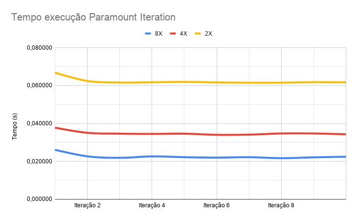

## Informações básicas

- Aluno: Matheus Ferraroni Sanches
- RA: 212142
- Data: maio/2020
- Objetivo: Avaliar o tempo das paramount iteration da aplicação Gromacs utilizando a ferramenta <a href="https://github.com/lmcad-unicamp/CLAP">CLAP</a>.

## Instâncias

Tipo da instância: t2.micro

AMI: ami-039a49e70ea773ffc

Security group: Foi definido um security group padrão para todas as as instâncias


## Grupo

Foi criado o arquivo ```~/.clap/groups/action.d/gromacs.yml``` contendo as seguintes actions:

**setup:** Executada ao adicionar um nó no grupo. É responsável por baixar o arquivo ```script_setup.sh``` e executá-lo. Esse script instala as dependências necessárias e prepara o gromacs para ser executado.

**simulation-setup:** Executa o ```configurer.sh```. Esse script prepara a simulação do gromacs para ser executada.

**configure-hosts:** Essa action gera as chaves para acesso ssh, baixa, envia para os hosts do grupo, adiciona nas chaves permitidas, gera um arquivo ```sh``` para adicionar os ips dos outros hosts do grupo nas conexões já conhecidas com o programa ```ssh-keyscan```

**run:** Responsável por entrar na pasta onde a simulação do gromacs está configurada e rodar o comando ```mpirun``` para iniciar a execução.

**fetch-result:** Baixa os resultados gerados pelo gromacs ```gmx.out``` e ```gmx.err```


Quando uma máquina é adicionada ao host é executada a action setup automaticamente.


## Cluster

Foram definidos 3 clusters diferentes: clapp cluster start cluster-t2-micro-2x, clapp cluster start cluster-t2-micro-4x e clapp cluster start cluster-t2-micro-8x. Os clusters variam apenas na quantidade de instâncias utilizadas.

Abaixo é apresentado o arquivo de configuração do cluster cluster-t2-micro-2x.
```
setups:
  config-master-1:
    groups:
    - name: gromacs/master
    actions:
    - type: command
      command: touch master.txt


  config-slave-1:
    groups:
    - name: gromacs/slave
    actions:
    - type: command
      command: touch slave.txt


  prepara-tudo:
    actions:
    - type: action
      name: configure-hosts
      group: gromacs
    - type: action
      name: simulation-setup
      group: gromacs


clusters:
  cluster-t2-micro-2x:
    nodes:
      node-slave:
        type: type-a
        count: 1
        min_count: 1
        setups: 
        - config-slave-1
      node-master:
        type: type-a
        count: 1
        min_count: 1
        setups: 
        - config-master-1

    after:
    - prepara-tudo
```

É possível ver que o comando ```after``` foi utilizado para chamar as actions ```configure-hosts``` e ```simulation-setup``` uma vez que os hosts estejam criados.


## Execução Manual


1. Executar ```clapp cluster start cluster-t2-micro-2x``` (O nome do cluster pode ser 2x, 4x ou 8x)
2. Executar ```clapp cluster list``` para definir o id do cluster e o id do host definido como master
4. Executar ```clapp cluster action cluster-XX gromacs run --nodes node-YY``` para executar o gromacs
5. Executar ```clapp cluster action cluster-XX gromacs fetch-result --nodes node-YY``` para obter os resultados

## Execução com script

Os arquivos executer_2x.sh, executer_4x.sh e executer_8x.sh foram preparados para executar todo o processo automaticamente.


## Resultados

Os resultados obtidos podem ser vistos na planilha : <a href="https://docs.google.com/spreadsheets/d/1l1yDp_OvDGxEdpgnf0f4aUvdMhV4_63K8e7S9iVdPx8/edit?usp=sharing">https://docs.google.com/spreadsheets/d/1l1yDp_OvDGxEdpgnf0f4aUvdMhV4_63K8e7S9iVdPx8/edit?usp=sharing</a>


A tabela abaixo apresenta a estimativa para execução de 700 iterações, aproximadamente o total de execuções das paramount iteration.

### Duas máquinas

| Iteração | Tempo médio | Tempo total estimado |
|----------|-------------|----------------------|
| 1        | 0,066813    | 46,878154            |
| 2        | 0,064615    | 45,340079            |
| 3        | 0,063605    | 44,632787            |
| 4        | 0,063137    | 44,305391            |
| 5        | 0,062897    | 44,137584            |
| 6        | 0,062690    | 43,992054            |
| 7        | 0,062519    | 43,872804            |
| 8        | 0,062393    | 43,784591            |
| 9        | 0,062325    | 43,737215            |
| 10       | 0,062265    | 43,694554            |

### Quatro máquinas

| Iteração | Tempo médio | Tempo total estimado |
|----------|-------------|----------------------|
| 1        | 0,037768    | 27,265892            |
| 2        | 0,036416    | 26,319754            |
| 3        | 0,035815    | 25,898850            |
| 4        | 0,035480    | 25,664554            |
| 5        | 0,035304    | 25,540777            |
| 6        | 0,035088    | 25,390008            |
| 7        | 0,034948    | 25,291667            |
| 8        | 0,034919    | 25,271351            |
| 9        | 0,034896    | 25,255414            |
| 10       | 0,034835    | 25,212704            |

### Oito máquinas

| Iteração | Tempo médio | Tempo total estimado |
|----------|-------------|----------------------|
| 1        | 0,026104    | 19,373754            |
| 2        | 0,024379    | 18,166254            |
| 3        | 0,023541    | 17,579770            |
| 4        | 0,023313    | 17,420207            |
| 5        | 0,023092    | 17,265861            |
| 6        | 0,022906    | 17,135241            |
| 7        | 0,022807    | 17,065891            |
| 8        | 0,022666    | 16,967460            |
| 9        | 0,022606    | 16,925504            |
| 10       | 0,022589    | 16,913586            |


A figura abaixo apresenta o tempo de execução das primeiras 10 execuções da paramount iteration.
<p align="center">
	
</p>
